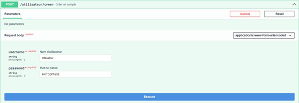
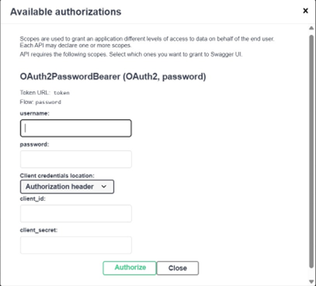

# Projet informatique de 2e année ENSAI

This application is a REST API used to query a database of cocktails and ingredients 
to find recipe ideas based on the ingredients you have. The user can create an 
account, add cocktails to favorites, and add the ingredients they possess to their inventory.

In the following sections we will show you:
- the prerequisites before launching the application
- how to launch the application
- how to use it. 

## → Software and tools

- [Visual Studio Code](https://code.visualstudio.com/)
- [Python 3.13](https://www.python.org/)
- A [PostgreSQL](https://www.postgresql.org/) database
- A Browser

## → Setting up the application

- [ ] Open VSCode with port 9876 if working on Onyxia
- [ ] Open **Git Bash**
- [ ]  clone the repo (if the folder is not already in your directory)
  - `clone the repo git clone https://github.com/bbrunel/ENSAI-2A-projet-info.git`


### Open Folder

- [ ] Open **Visual Studio Code**
- [ ] File > Open Folder
- [ ] Select folder *ENSAI-2A-projet-info-template*
  - *ENSAI-2A-projet-info* should be the root of your Explorer
  - :warning: if not the application will not launch. Retry open folder

### Install required packages

- [ ] In Git Bash, run the following commands to:
  - install all packages from file `requirements.txt`
  - list all packages

```bash
pip install -r requirements.txt
```

###  Environment variables

You are now going to define environment variables to declare the database 

At the root of the project :

- [ ] Create a file called `.env`
- [ ] Paste in and complete the elements below

```default
POSTGRES_HOST=
POSTGRES_PORT=
POSTGRES_DATABASE=
POSTGRES_USER=
POSTGRES_PASSWORD=
```

## → Launch the App

- You must first initialize the PostgreSQL database using one of the following commands:
```bash
python src/utils/init_database.py
uv run src/utils/init_database.py
```

- To launch the API, run one of the following commands:
```bash
python src/main.py
uv run src/main.py
```

- Normally, if you are using the Onyxia Datalab, a small window will appear at the bottom right; click “Open in Browser” to open the application page in your browser.
- If you are running locally, open a browser and go to: (http://localhost:9876/docs)


## → Using the App

You can now access the different endpoints of the application:

- To run a feature, expand the section and click “Try it out”, or make the request directly in your browser.
- Some features are locked (padlock icon) until you are authenticated.
- You can start by going to the “User” section and creating an account if you haven’t done so already.
- Go to the endpoint “POST /utilisateur/creer” and click “Try it out”. You will then be able to enter a username and password in the corresponding fields. Note: although the password is hidden when viewing your user information, it is displayed on-screen when typing it in the endpoint. Be careful when typing your password, including when modifying it later.


Once the account is created, you can authenticate to access additional features. To do so, click on the green “Authorize” button at the top right of the page and enter your username and password in the “username” and “password” fields. This time, the password will be properly hidden. You now have access to most of the application's features!



- After execution, you will be able to copy the URL or download the results.


