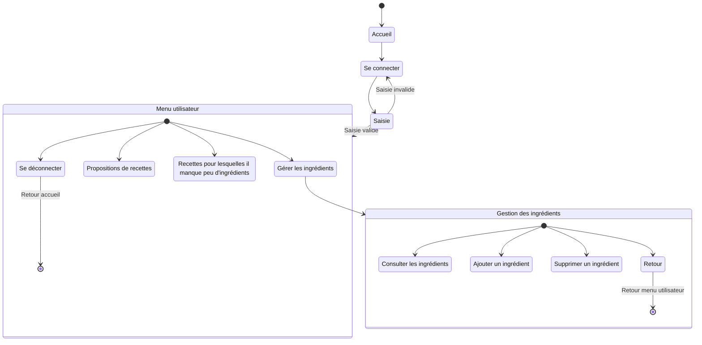
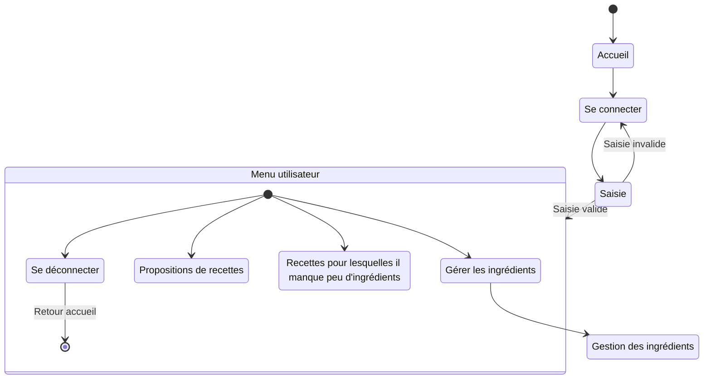
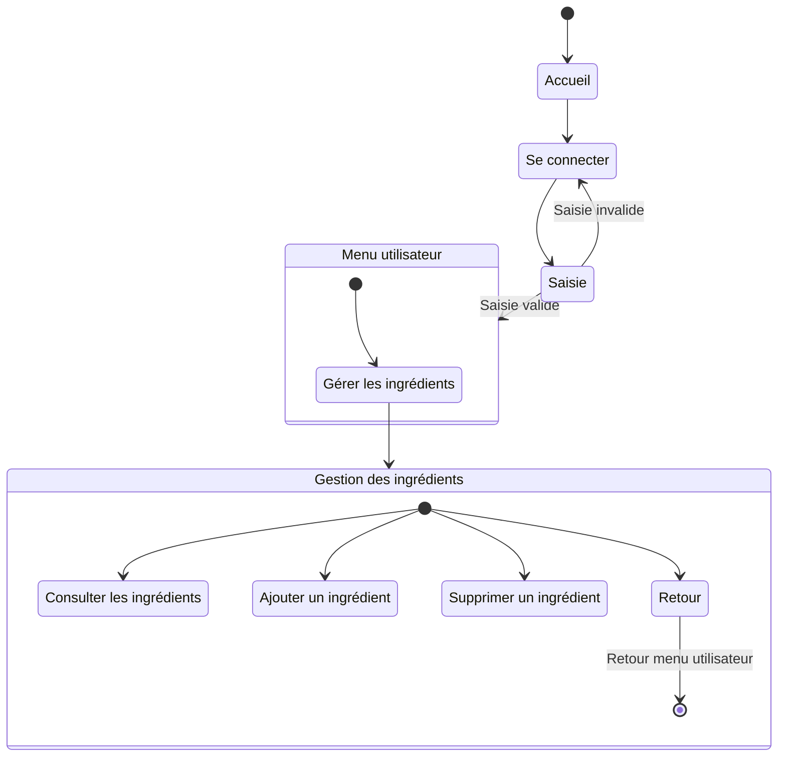
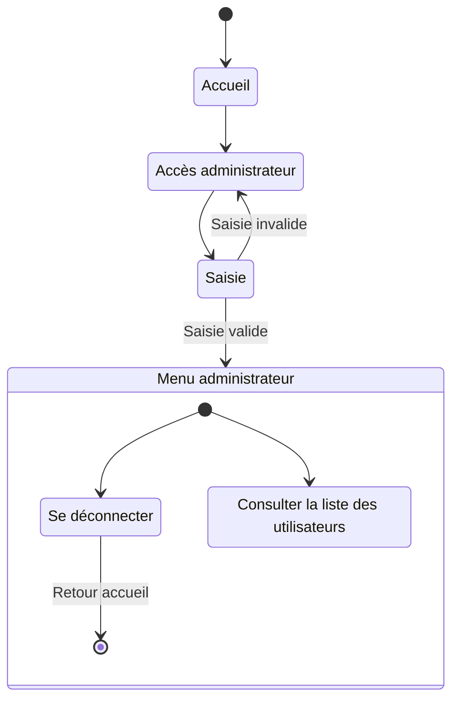

# Diagramme d'activité

> Un diagramme UML d'activité modélise le flux de travail d'un processus, montrant la séquence d'activités et de décisions dans un système. Il illustre comment les actions s'enchaînent et comment les choix sont faits.

Ce diagramme est codé avec [mermaid](https://mermaid.js.org/syntax/stateDiagram.html) :

- avantage : facile à coder
- inconvénient : on ne maîtrise pas bien l'affichagev

Pour afficher ce diagramme dans VScode :

- à gauche aller dans **Extensions** (ou CTRL + SHIFT + X)
- rechercher `mermaid`
  - installer l'extension **Markdown Preview Mermaid Support**
- revenir sur ce fichier
  - faire **CTRL + K**, puis **V**

## 1er diagramme : global

## 2e diagramme : accueil

## 3e diagramme : centré sur la connexion

## 4e diagramme : menu utilisateurs

## 5e diagramme : menu ingrédients

## 6e diagramme : menu administrateur

