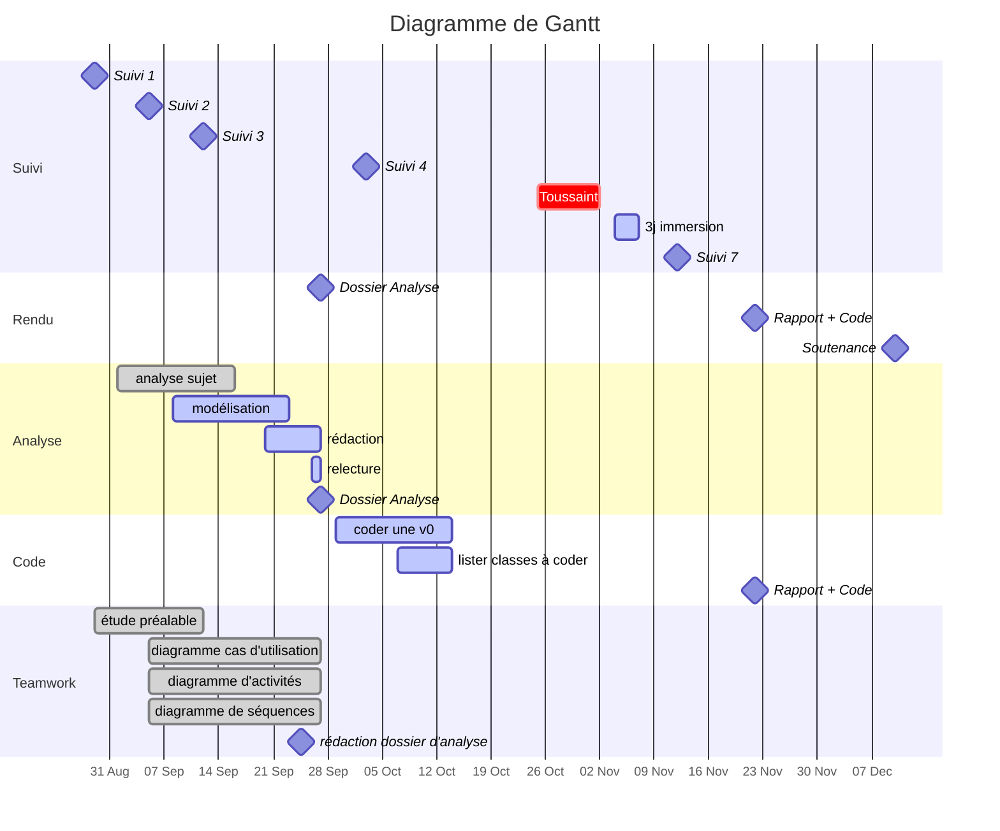
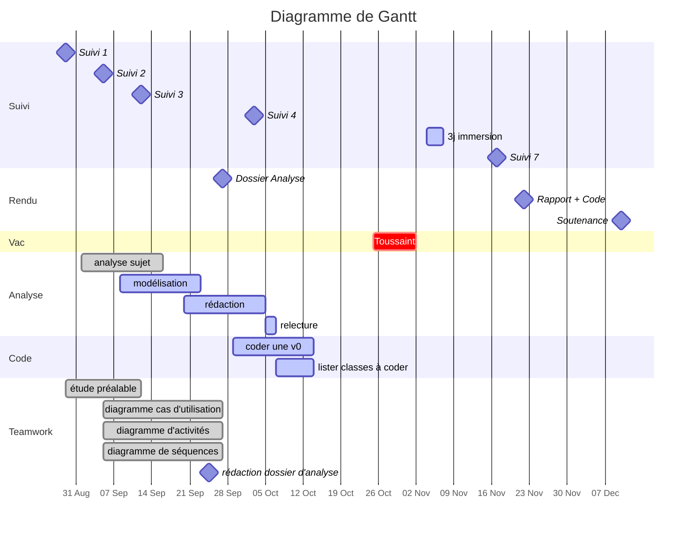

```mermaid
gantt
    %% doc : https://mermaid-js.github.io/mermaid/#/./gantt
    dateFormat  YYYY-MM-DD
    axisFormat  %d %b
    title       Diagramme de Gantt
    %%excludes  YYYY-MM-DD and/or sunday and/or weekends 
     
    section Suivi
    Suivi 1                      :milestone, 2025-08-29,
    Suivi 2                      :milestone, 2025-09-05,
    Suivi 3                      :milestone, 2025-09-12,
    Suivi 4                      :milestone, 2025-10-03,
    Toussaint                    :crit,    2025-10-25, 2025-11-02
    3j immersion                 :active,    2025-11-04, 3d
    Suivi 7                      :milestone, 2025-11-17
    
    section Rendu
    Dossier Analyse              :milestone, 2025-09-27,
    Rapport + Code               :milestone, 2025-11-22,
    Soutenance                   :milestone, 2025-12-10,
    
    section Vac
    
    section Analyse
    analyse sujet                :done,      2025-09-01, 15d
    modélisation                 :active,    2025-09-08, 15d
    rédaction                    :active,    2025-09-20, 2025-09-27
    relecture                    :active,    2025-09-26, 2025-09-27
    Dossier Analyse              :milestone, 2025-09-27,
    
    
    section Code
    coder une v0                 :active,    2025-09-29, 15d
    lister classes à coder       :active,    2025-10-07, 7d
    Rapport + Code               :milestone, 2025-11-22,

    section Teamwork
    étude préalable              :done,      2025-08-29, 14d
    diagramme cas d'utilisation  :done,      2025-09-05, 2025-09-27
    diagramme d'activités        :done,      2025-09-05, 2025-09-27
    diagramme de séquences       :done,      2025-09-05, 2025-09-27
    rédaction dossier d'analyse  :milestone, 2025-09-22, 2025-09-27
    

    %%Stats univariées retraités   :done,         2021-11-28, 3d
```

```mermaid
gantt
    %% doc : https://mermaid-js.github.io/mermaid/#/./gantt
    dateFormat  YYYY-MM-DD
    axisFormat  %d %b
    title       Diagramme de Gantt
    %%excludes  YYYY-MM-DD and/or sunday and/or weekends 
     
    section Suivi
    Suivi 1                      :milestone, 2025-08-29,
    Suivi 2                      :milestone, 2025-09-05,
    Suivi 3                      :milestone, 2025-09-12,
    Suivi 4                      :milestone, 2025-10-03,
    3j immersion                 :active,    2025-11-04, 3d
    Suivi 7                      :milestone, 2025-11-17,
    
    section Rendu
    Dossier Analyse              :milestone, 2025-09-27,
    Rapport + Code               :milestone, 2025-11-22,
    Soutenance                   :milestone, 2025-12-10,
    
    section Vac
    Toussaint                    :crit,    2025-10-25, 2025-11-02
    
    section Analyse
    analyse sujet                :done,      2025-09-01, 15d
    modélisation                 :active,    2025-09-08, 15d
    rédaction                    :active,    2025-09-20, 2025-10-05
    relecture                    :active,    2025-10-05, 2025-10-07
    
    section Code
    coder une v0                 :active,    2025-09-29, 15d
    lister classes à coder       :active,    2025-10-07, 7d

    section Teamwork
    étude préalable              :done,      2025-08-29, 14d
    diagramme cas d'utilisation  :done,      2025-09-05, 2025-09-27
    diagramme d'activités        :done,      2025-09-05, 2025-09-27
    diagramme de séquences       :done,      2025-09-05, 2025-09-27
    rédaction dossier d'analyse  :milestone, 2025-09-22, 2025-09-27
    

    %%Stats univariées retraités   :done,         2021-11-28, 3d
```
