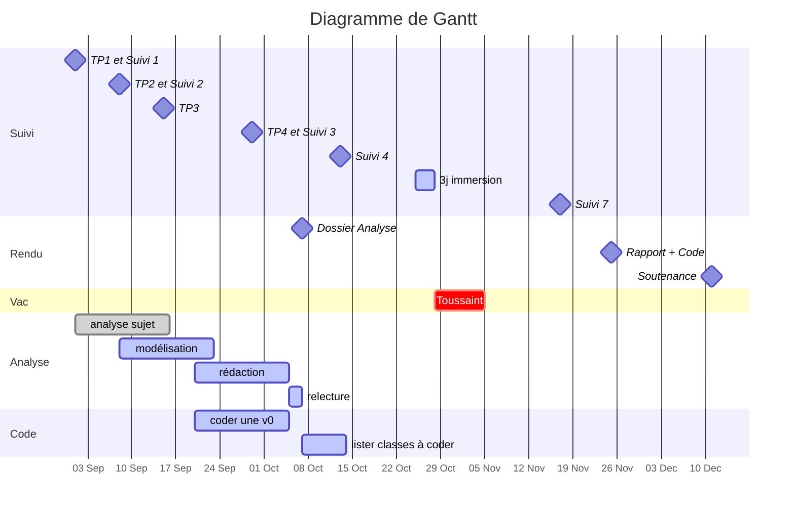
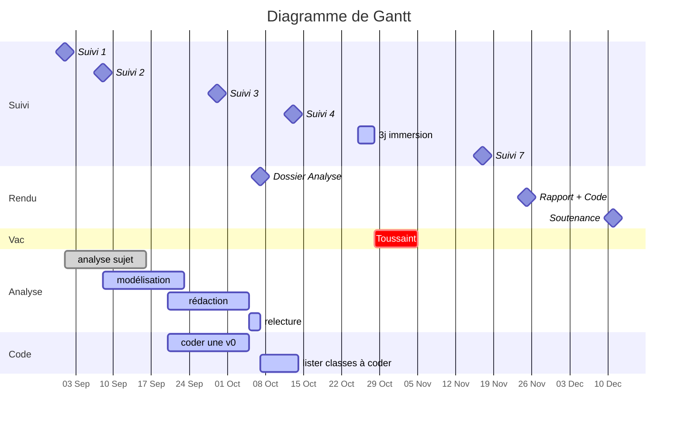

```mermaid
gantt
    %% doc : https://mermaid-js.github.io/mermaid/#/./gantt
    dateFormat  YYYY-MM-DD
    axisFormat  %d %b
    title       Diagramme de Gantt
    %%excludes  YYYY-MM-DD and/or sunday and/or weekends 
     
    section Suivi
    TP1 et Suivi 1               :milestone, 2023-09-01,
    TP2 et Suivi 2               :milestone, 2023-09-08,
    TP3                          :milestone, 2023-09-15,
    TP4 et Suivi 3               :milestone, 2023-09-29,
    Suivi 4                      :milestone, 2023-10-13,
    3j immersion                 :active,    2023-10-25, 3d
    Suivi 7                      :milestone, 2023-11-17,
    
    section Rendu
    Dossier Analyse              :milestone, 2023-10-07,
    Rapport + Code               :milestone, 2023-11-25,
    Soutenance                   :milestone, 2023-12-11,
    
    section Vac
    Toussaint                    :crit,    2023-10-28, 2023-11-05
    
    section Analyse
    analyse sujet                :done,      2023-09-01, 15d
    modélisation                 :active,    2023-09-08, 15d
    rédaction                    :active,    2023-09-20, 2023-10-05
    relecture                    :active,    2023-10-05, 2023-10-07
    
    section Code
    coder une v0                 :active,    2023-09-20, 15d
    lister classes à coder       :active,    2023-10-07, 7d
    

    %%Stats univariées retraités   :done,         2021-11-28, 3d
```

```mermaid
gantt
    %% doc : https://mermaid-js.github.io/mermaid/#/./gantt
    dateFormat  YYYY-MM-DD
    axisFormat  %d %b
    title       Diagramme de Gantt
    %%excludes  YYYY-MM-DD and/or sunday and/or weekends 
     
    section Suivi
    Suivi 1               :milestone, 2023-09-01,
    Suivi 2               :milestone, 2023-09-08,
    Suivi 3               :milestone, 2023-09-29,
    Suivi 4               :milestone, 2023-10-13,
    3j immersion                 :active,    2023-10-25, 3d
    Suivi 7                      :milestone, 2023-11-17,
    
    section Rendu
    Dossier Analyse              :milestone, 2023-10-07,
    Rapport + Code               :milestone, 2023-11-25,
    Soutenance                   :milestone, 2023-12-11,
    
    section Vac
    Toussaint                    :crit,    2023-10-28, 2023-11-05
    
    section Analyse
    analyse sujet                :done,      2023-09-01, 15d
    modélisation                 :active,    2023-09-08, 15d
    rédaction                    :active,    2023-09-20, 2023-10-05
    relecture                    :active,    2023-10-05, 2023-10-07
    
    section Code
    coder une v0                 :active,    2023-09-20, 15d
    lister classes à coder       :active,    2023-10-07, 7d
    

    %%Stats univariées retraités   :done,         2021-11-28, 3d
```