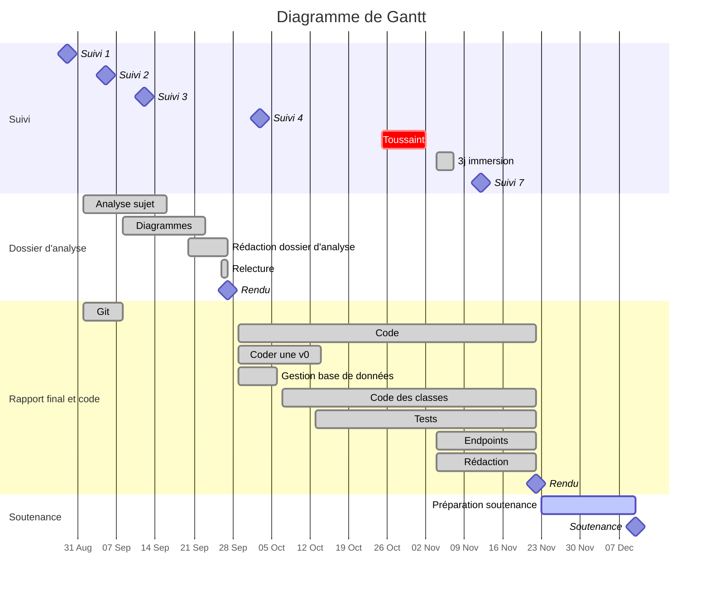

```mermaid
gantt
    %% doc : https://mermaid-js.github.io/mermaid/#/./gantt
    dateFormat  YYYY-MM-DD
    axisFormat  %d %b
    title       Diagramme de Gantt
    %%excludes  YYYY-MM-DD and/or sunday and/or weekends 
     
    section Suivi
    Suivi 1                      :milestone, 2025-08-29,
    Suivi 2                      :milestone, 2025-09-05,
    Suivi 3                      :milestone, 2025-09-12,
    Suivi 4                      :milestone, 2025-10-03,
    Toussaint                    :crit,    2025-10-25, 2025-11-02
    3j immersion                 :done,    2025-11-04, 3d
    Suivi 7                      :milestone, 2025-11-17

    section Dossier d'analyse
    Analyse sujet                :done,      2025-09-01, 15d
    Diagrammes                   :done,    2025-09-08, 15d
    Rédaction dossier d'analyse  :done,    2025-09-20, 2025-09-27
    Relecture                    :done,    2025-09-26, 2025-09-27
    Rendu                        :milestone, 2025-09-27,
    
    section Rapport final et code
    Git                          :done,    2025-09-01, 7d
    Code                         :done,    2025-09-29, 2025-11-22
    Coder une v0                 :done,    2025-09-29, 15d
    Gestion base de données      :done,    2025-09-29, 7d
    Code des classes             :done,    2025-10-07, 2025-11-22
    Tests                        :done,    2025-10-13, 2025-11-22
    Endpoints                    :done,    2025-11-04, 2025-11-22
    Rédaction                    :done,    2025-11-04, 2025-11-22
    Rendu                        :milestone, 2025-11-22,

    section Soutenance
    Préparation soutenance       :active,    2025-11-23, 2025-12-10
    Soutenance                   :milestone, 2025-12-10,

```
