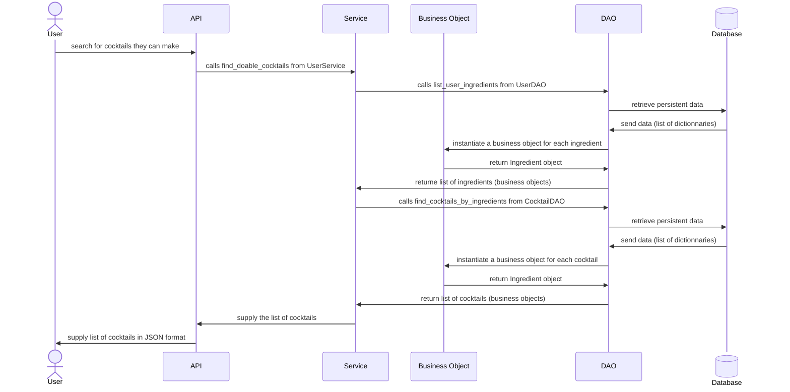

# Diagramme de séquence

Ce diagramme est codé avec [mermaid](https://mermaid.js.org/syntax/stateDiagram.html).

J'ai fait le choix de ne représenter qu'une action possible de l'utilisateur pour un soucis de lisibilité.
L'objectif de ce diagramme est de comprendre l'utilité de chaque couche du logiciel et leurs interractions.

